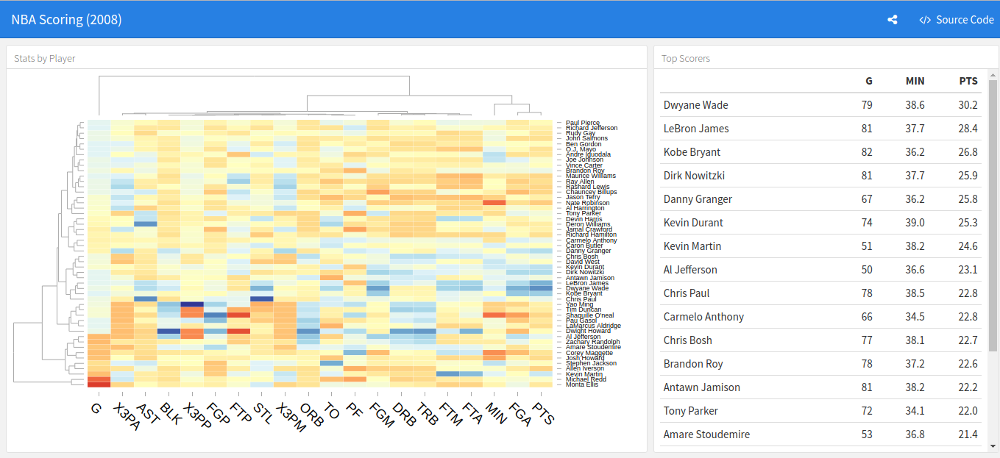
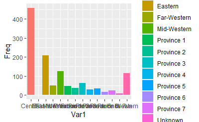

```{r setup, include=FALSE}
knitr::opts_chunk$set(echo = FALSE,
message = FALSE,	warning = FALSE)
```


## Data 

Descriptions:
Our data is About Terror attack of South Asia , especailly Nepal, between the year 1985-2017

Our data is about:
* Terror Attack
* With 1216 rows, 21 columns

## Problems

* NUll Values
* Missing Values
* UNwanted Features

## What we solved?
   We cleaned by : .
   
   
   
   
   
           1) Two Unwanted features " Latitude " and "Longitude " were removed from the data set.
           2) Missing values of nkill and nwound were filled by the median of their respective columns
           3) we analysed the data using bar graphs and other graphs.
           
          


<!--  -->


```{r message=FALSE, warning=FALSE, include=FALSE}
library(ggplot2)
library(dplyr)
library(lubridate)
```


```{r message=FALSE, warning=FALSE, include=FALSE, paged.print=FALSE}
gtd<- read.csv("C:Users/User/Desktop/Data Hack/gtd_nepal.csv",stringsAsFactors = FALSE)
gtd
```


## Analysis (insert plots in slide if you don't have dashboards)

```{r}
library(ggplot2)
ggplot(cars, aes(x= speed, y = dist)) +
  geom_point()
  
```

## Demo (Make Dashboard with Flexdashboard)





<!-- 
<script type="text/javascript">
window.addEventListener("mousedown", handleClick, false);
window.addEventListener("contextmenu", function(e) { e.preventDefault(); }, false);

function handleClick(e) {
	e.preventDefault();
	if(e.button === 0) Reveal.next(); 
	if(e.button === 2) Reveal.prev(); 
}
</script>


-->


